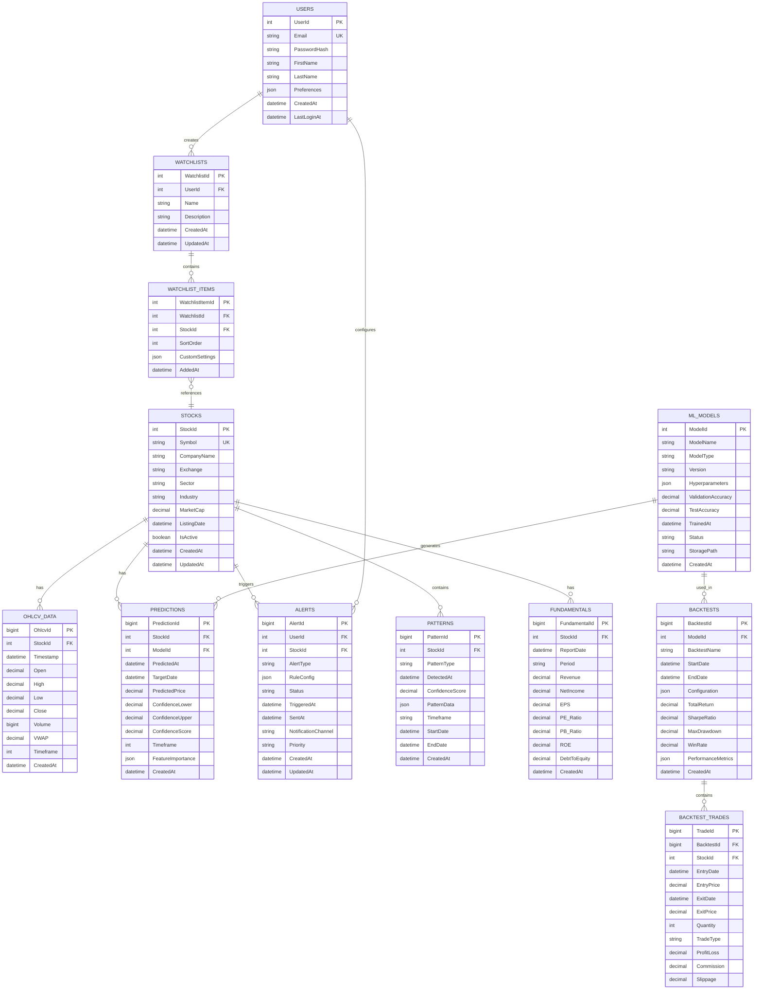

# System Architecture Diagrams

## Table of Contents
1. [High-Level System Architecture](#high-level-system-architecture)
2. [Data Flow Architecture](#data-flow-architecture)
3. [ML Pipeline Architecture](#ml-pipeline-architecture)
4. [Component Interaction Diagram](#component-interaction-diagram)
5. [Deployment Topology](#deployment-topology)
6. [Database Entity Relationships](#database-entity-relationships)

---

## High-Level System Architecture

---

## Data Flow Architecture

### Real-Time Quote Processing Flow

### ML Prediction Pipeline Flow

### Backtesting Workflow

---

## ML Pipeline Architecture

### Model Training Pipeline

### Inference Pipeline

---

## Component Interaction Diagram

### Alert Processing System

---

## Deployment Topology

### Phase 1: Local Workstation

### Phase 2: Hybrid Cloud Deployment

---

## Database Entity Relationships

### SQL Server Schema

### MongoDB Schema Design

### Redis Cache Structure

---

## Service Communication Patterns

### CQRS Pattern Implementation

---

## Network & Security Architecture

---

**Document Version**: 1.0
**Last Updated**: 2026-02-03
